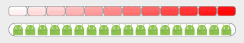

# CustomProgressBar

## 使用示例
```xml
<com.cm.customprogressbar.CustomProgressBar
    android:id="@+id/progressBar"
    android:layout_width="match_parent"
    android:layout_height="15dp"
    android:background="@drawable/bg"
    app:progress="100%"
    app:isFixationItemWidth="false"
    app:isFullGradient="true"
    app:isGradient="true"/>

<com.cm.customprogressbar.CustomProgressBar
    android:id="@+id/progressBar2"
    android:layout_width="match_parent"
    android:layout_height="20dp"
    android:layout_below="@id/progressBar"
    android:layout_marginTop="10dp"
    android:background="@drawable/bg"
    android:paddingLeft="5dp"
    android:paddingRight="5dp"
    app:progress="100%"
    app:itemCount="18"
    app:itemDrawable="@mipmap/ic_launcher"/>
```

## 效果展示



## 自定义属性
```xml
<declare-styleable name="CustomProgressBar">
    <!--进度-->
    <attr name="progress" format="fraction"/>

    <!--开始颜色-->
    <attr name="startColor" format="color|reference"/>

    <!--结束颜色-->
    <attr name="endColor" format="color|reference"/>

    <!--item的宽度-->
    <attr name="itemWidth" format="dimension|reference"/>

    <!--是否整体渐变,false则渐变作用在当前进度-->
    <attr name="isFullGradient" format="boolean"/>

    <!--是否固定进度item宽度,true则不会去平均整体宽度-->
    <attr name="isFixationItemWidth" format="boolean"/>

    <!--item 的Drawable-->
    <attr name="itemDrawable" format="reference"/>

    <!--是否使用渐变-->
    <attr name="isGradient" format="boolean"/>

    <!--item个数-->
    <attr name="itemCount" format="integer"/>
</declare-styleable>
```